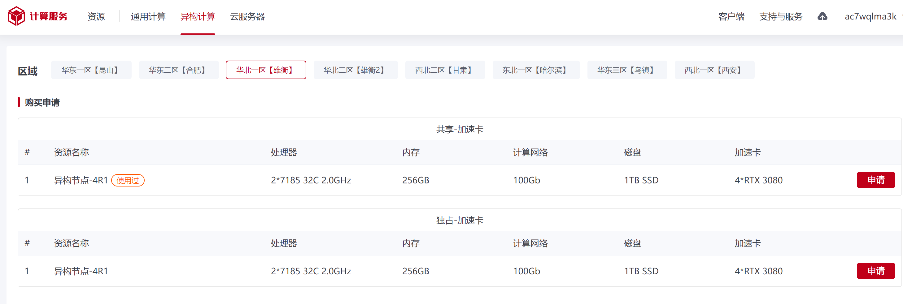
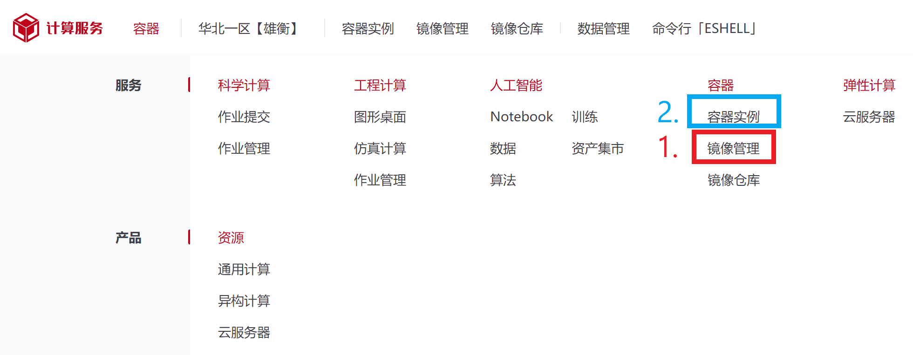
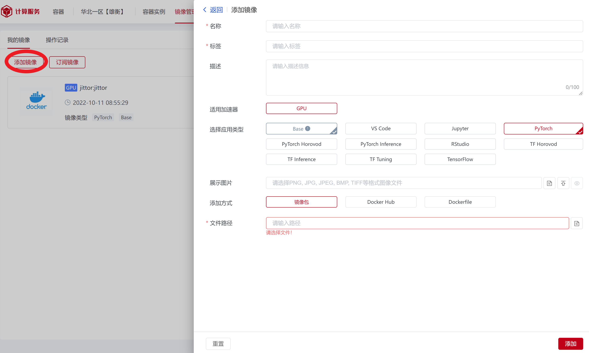
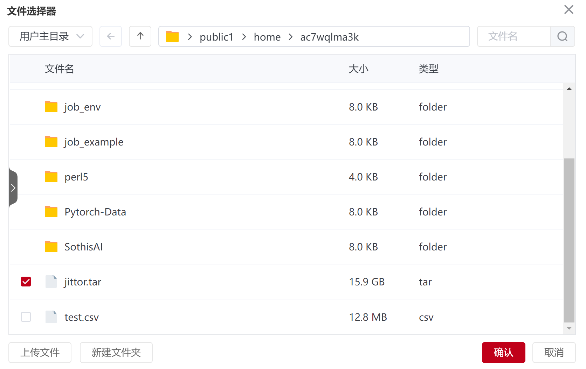
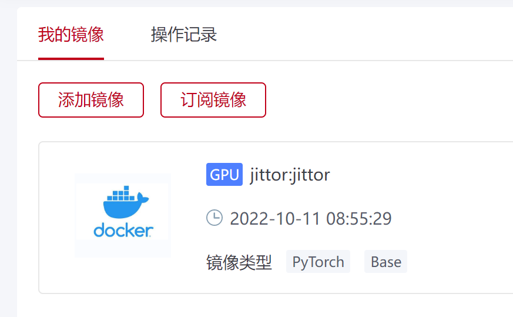
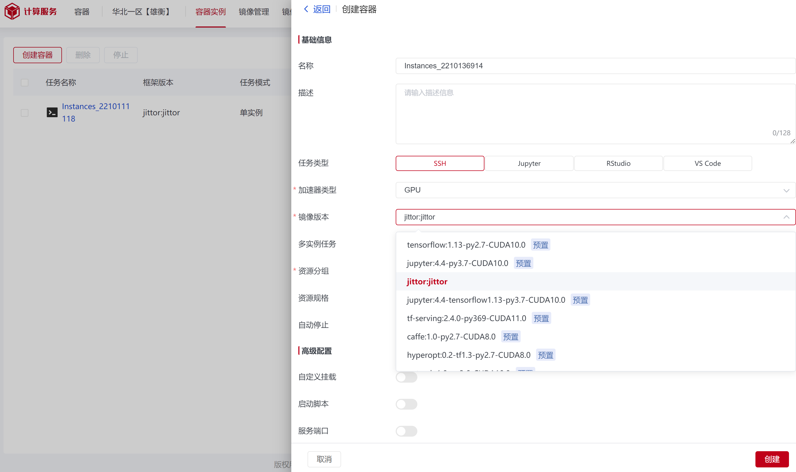
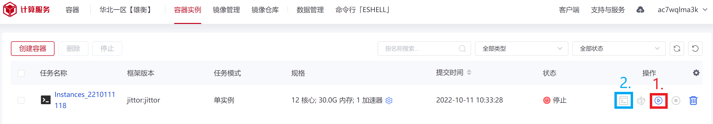
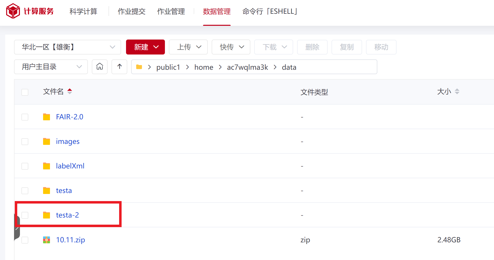

## 粤港澳大湾区（黄埔）国际算法算力大赛-遥感图像目标检测赛道-评测使用说明

### 1. 申请服务器

曙光超算平台，进入控制台，选择产品-异构计算，我这里申请的是华北一区【雄衡】




### 2. 添加镜像



见上图红色方框



文件选择选手的.tar文件，这里我将名称设为“jittor”



添加成功



### 3. 创建容器

选择镜像版本为你刚刚添加的镜像，这里示例为“jittor:jittor”



创建成功



### 4. 运行容器

上图红色方框为运行，等待部署，部署成功后，蓝色方框为运行后的SSH打开终端，进入docker

若点击运行后一直处在等待中，可能是你所申请的硬件数量超过可用数量，可以适当调小。

### 5. 准备训练集与测试集

此处示例为576张后缀为.tif的测试集。



训练集图片我这里随便放30张FAIRM-2.0的训练集图像在`/images`中，对应的30个标签在`/labelXml`中

### 6. 数据预处理

数据集图像分辨率很大，选手大多需要提前裁剪图像，生成裁剪后的图像以及对应的标签文件。

首先进入root用户
```
sudo su root
```

再依次运行以下命令：
```
cd /

cd root/player # 进入选手的文件夹
```

接下来依照选手的流程，转移数据集到选手指定的路径，即从我们的个人用户目录转移至`/root/player/`下的选手指定目录。

一般为如下样式：

    ```
    {DATASET_PATH}
        |
        └──data 
            ├──train
            |     ├──images
            |     |    ├──1.tif
            |     |    └──...
            |     └──labelXml
            |          ├──1.xml
            |          └──...
            └──test
                  └──images
                       ├──1.tif
                       └──...
    ```

可能需要修改选手的数据预处理程序，修改目录为数据集存放目录，运行选手提供的数据预处理。

例如，选手的数据预处理文件为`process_data.py`，我们可使用

```
vim process_data.py
```

键入`i`进入输入模式，键入`Esc`退出输入模式，然后键入`:wq`保存并退出。键入`:q`表示无需保存直接退出。

### 7. 复现训练与测试

依照选手给的训练命令，查看训练是否正常进行，等待漫长的编译时间。

测试同理，最终生成.csv文件，大功告成。

PS：
*  建议提前给选手提供的预训练模型copy一份备用，以免在训练时可能被保存权重所覆盖。
*  若造成任何不可挽回的错误，退出docker，重新启动容器，再来一遍。
